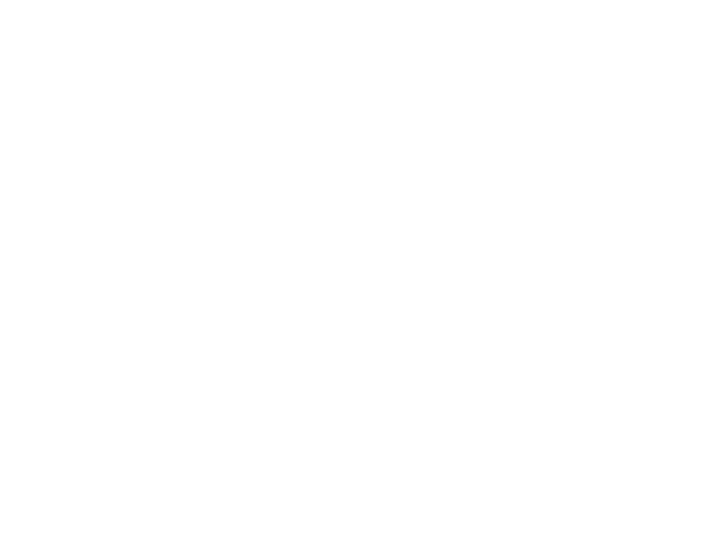

# VM Migration Analyzer

> [!WARNING]
> All of the metrics herein are constrained by what the MTV tool collects. That means things such as Windows reboot times are NOT included as the Migration plans do not rack this data!

**VM Migration Analyzer** is a Python toolkit designed to process, analyze, and visualize virtual machine (VM) migration data. It parses OpenShift's [MTV](https://docs.redhat.com/en/documentation/migration_toolkit_for_virtualization/2.8) migration plans YAML files, calculates effective migration times, analyzes concurrent migrations, and produces reports with visualizations. This tool is particularly useful for migration teams who need to understand migration performance metrics and optimize future migration waves.

## Features

- **YAML Migration Plan Processing:** Parses VM migration plans to extract critical timing and resource information
- **Smart Migration Time Analysis:** Detects significant drops in precopy duration to accurately calculate effective migration times
- **Comprehensive Reporting:** Generates detailed reports on successful and failed migrations, OS distribution, and performance metrics
- **Concurrency Analysis:** Tracks and analyzes concurrent migrations to identify peaks, patterns, and resource utilization
- **Visualization:** Creates Gantt charts to visualize migration timelines and identify overlapping migrations
- **Performance Metrics:** Calculates key indicators like transfer speeds, average durations, and resource efficiency

## Installation

VM Migration Analyzer can be installed directly from GitHub using pip, or executed from a cloned repository.

### Using pip

```bash
pip install git+https://github.com/rhtools/mtv-parser.git
```

### From GitHub repository

```bash
git clone https://github.com/rhtools/mtv-parser.git
cd mtv-parser
pip install -r requirements.txt
python mtv_parser/mtv_plan_parser.py
```

## Required Dependencies

- PyYAML: For parsing YAML migration plan files
- matplotlib: For generating Gantt chart visualizations
- tabulate: For formatting CLI output tables

## Input File Format

The analyzer expects YAML files containing VM migration plan data with the following structure:

- Migration metadata and specifications
- VM details including operating system information
- Migration status with timestamps
- Pipeline phases including disk transfer data
- Warm migration details with precopy information

Example structure (simplified):

```yaml
items:
  - metadata:
      name: migration-plan-1
    spec:
      vms:
        - name: vm1
    status:
      migration:
        started: "2023-04-01T10:00:00"
        completed: "2023-04-01T11:30:00"
        vms:
          - name: vm1
            operatingSystem: "Windows"
            pipeline:
              - name: "DiskTransfer"
                started: "2023-04-01T10:00:00"
                completed: "2023-04-01T10:45:00"
                progress:
                  total: 102400
            warm:
              precopies:
                - start: "2023-04-01T10:00:00"
                  end: "2023-04-01T10:15:00"
            conditions:
              - type: "Succeeded"
```

In the simplest form this can be obtained by running the following on an OpenShift Cluster
```
oc get plan -A -o yaml > migration_plan.yaml
```

> [!NOTE]
> There are a couple of data samples in the `examples` folder in this repo.

## Usage

To analyze VM migration data:

```bash
python mtv_parser/mtv_plan_parser.py
```

By default, the script reads from `examples/vm-plans-sample2.yaml`. You can modify the file path in the script to point to your own YAML files.

> [!IMPORTANT]
> Currently no arguments are accepted. That means that either you need to overwrite the sample file or edit the `mtv_plan_parser.py` to update which file it opens. In the future, this will likely be a container for simplicity.

## Module Structure

| Module | Description |
|--------|-------------|
| `mtv_plan_parser.py` | Main script that orchestrates the analysis process |
| `vm_information.py` | Core functions for extracting and analyzing VM migration data |
| `clioutput.py` | Handles formatting and display of results to the command line |
| `visualization.py` | Creates Gantt charts for visualizing migration timelines |

## Key Functions

### VM Information Module

**`calculate_effective_migration_time(vm, entry)`**
- Analyzes precopy phases to determine when migration effectively completed
- Detects significant drops in precopy duration to mark effective completion
- Falls back to regular migration times if no precopies are found

**`extract_vm_information(vm)`**
- Extracts essential VM data including OS, disk size, and transfer times
- Organizes information into a standardized dictionary structure

**`analyze_concurrent_migrations(all_vms)`**
- Tracks VM migrations over time to analyze concurrency patterns
- Identifies peak concurrent migrations and their timing
- Calculates hourly statistics and average concurrent VMs

### MTV Plan Parser Module

**`add_to_dict(vm_information, dict_to_update, effective_duration)`**
- Processes VM information and adds it to the migration dataset
- Calculates end times based on start times and effective durations

**`main()`**
- Primary function that orchestrates the entire analysis workflow
- Processes YAML data and generates reports and visualizations

### CLI Output Module

The `CLIOutput` class provides methods for generating formatted reports:

- `migration_output()`: Generates reports on successful or failed migrations
- `operating_system_report()`: Creates breakdowns by operating system
- `generate_concurrency_report()`: Produces concurrency analysis reports

### Visualization Module

**`plot_gantt_chart(data)`**
- Creates a visualization of VM migrations as a Gantt chart
- Shows timing relationships between different migrations
- Saves the chart as a PNG file

## Example Output

The analyzer produces several reports in one output:

```
MIGRATION REPORT
================

The number of successful migrations:             7
------------------------------------
The number of vms:                               19
Plan with longest runtime:                       105289-group-3
Longest runtime in minutes:                      430.3
Total disk size in longest plan (GB):            532.0
Transferred data per hour in longest plan (GB):  1.2
Shortest runtime in minutes:                     9.5
Average runtime in minutes:                      275.3
Average disk size (GB):                          658.7
Average transfer per hour (GB):                  2.4
Total Disk Size Migrated (GB):                   4611.0


OS REPORT
=========

Report for windows2022srvNext_64Guest:
--------------------------------------
Number of VMs:                             3
Total Disk Size (GB):                    992

Report for otherGuest64:
------------------------
Number of VMs:                            14
Total Disk Size (GB):                   3619


CONCURRENCY REPORT
==================

Peak concurrent VMs:                16
Peak time:                          2025-03-21 18:05:31+00:00
Average concurrent VMs:             8.0


Maximum concurrent VMs by OS type:
----------------------------------
otherGuest64:                       14
windows2022srvNext_64Guest:         2


Hourly concurrent VMs:
----------------------
2025-03-21 15:00:                   0 VMs
2025-03-21 16:00:                   5 VMs
2025-03-21 17:00:                   6 VMs
2025-03-21 18:00:                   6 VMs
2025-03-21 19:00:                   16 VMs
2025-03-21 20:00:                   16 VMs
2025-03-21 21:00:                   16 VMs
2025-03-21 22:00:                   6 VMs
2025-03-21 23:00:                   1 VMs
```

### Gantt Chart Visualization
The tool generates a Gantt chart visualization showing VM migrations over time. This chart helps identify:
- Migration overlaps and patterns
- Peak migration periods
- OS-specific migration behaviors

The chart is saved as `migration_gantt_chart.png` in the current directory.

Below is an example

## Advanced Features

### Effective Migration Time Analysis

The analyzer uses the following to determine the true effective migration time:

1. Analyzes all precopy phases for each VM
2. Identifies when precopy duration drops significantly (indicating data sync is nearly complete)
3. Calculates migration time from first precopy to the significant drop point
4. Falls back to total migration time if no significant drop is detected

The thought here is that while not 100% accurate due to the final copy of RAM to disk, there are many who start a migration plan then walk away and come back hours after the copies have completed. MTV's plan will officially be the entire time until the migration has been cut over. This is inaccurate and skews the metrics badly. By watching for a sharp drop off in precopy time we can "guess" at how long a cutover would have taken as if the cutover happened as soon as the VM had transferred all of the initial data.

### Concurrency Analysis

The tool provides insights into migration concurrency:

- Tracks which VMs are migrating at any given time
- Identifies peak concurrency periods
- Detects significant drops in concurrency
- Calculates hourly migration loads
- Breaks down concurrency by operating system

## Contributing

Contributions to VM Migration Analyzer are welcome! The codebase is organized into modules with clear responsibilities:

- `vm_information.py`: Core analysis functions and algorithms
- `mtv_plan_parser.py`: Main entry point and workflow orchestration
- `clioutput.py`: Output formatting and report generation
- `visualization.py`: Data visualization with matplotlib

To contribute:
1. Fork the repository
2. Create a feature branch (`git checkout -b feature/new-analysis`)
3. Commit your changes (`git commit -m 'Add new analysis capability'`)
4. Push to the branch (`git push origin feature/new-analysis`)
5. Open a Pull Request

